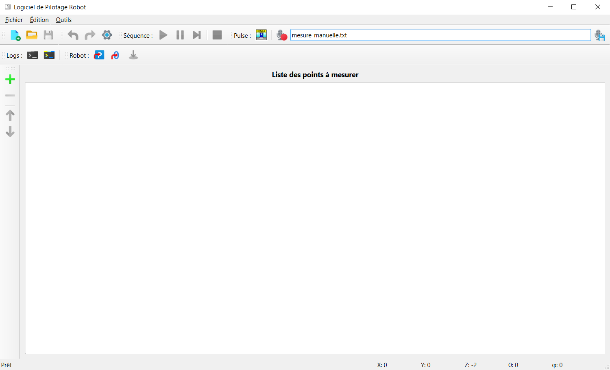

# Logiciel de Pilotage et d'Acquisition Acoustique

Ce logiciel contrôle le robot de positionnement 5 axes de l'UMRAE et s'interface avec PULSE LabShop pour réaliser des campagnes de mesures acoustiques automatisées. Il a été développé pour moderniser l'outil existant et offrir une expérience utilisateur plus simple, robuste et flexible.

## 🚀 Fonctionnalités principales

-   **Gestion de listes de points :** Importation de fichiers (CSV, ASCII) et édition directe dans un tableau.
-   **Séquenceur automatisé :** Exécution d'une séquence de mesures point par point, avec déclenchement automatique de l'acquisition dans PULSE LabShop.
-   **Contrôle manuel avancé :** Une télécommande complète pour des déplacements précis (pas à pas) ou rapides (contrôle au clavier en temps réel).
-   **Gestion simplifiée des coordonnées :** Le logiciel gère automatiquement la cinématique complexe du robot. L'utilisateur ne manipule que les coordonnées réelles du microphone (coordonnées "capsule").
-   **Outils de diagnostic :** Des visionneuses de logs dédiées pour suivre les communications avec le robot et PULSE LabShop, facilitant l'identification de problèmes.
-   **Configuration centralisée :** Une fenêtre de configuration permet de régler tous les paramètres (port série, ratios moteurs, chemins, etc.) sans toucher au code.

## 📋 Prérequis

### Matériel
-   Robot de mesure avec son contrôleur **Galil DMC-2260** (unité WB 1477).
-   Système d'acquisition compatible PULSE (ex: **Brüel & Kjær type 3660**).
-   Connexion série (RS-232) entre l'ordinateur et le contrôleur robot.

### Logiciel
-   **Système d'exploitation :** Windows 10 ou 11 (64-bit).
-   **Logiciel d'acquisition :** **PULSE LabShop v27.1** ou une version compatible.

## 🛠️ Installation et Lancement

L'application est fournie sous la forme d'un dossier contenant un exécutable autonome. Aucune installation n'est requise.

1.  Récupérez le dossier `RobotAcousticGUI` généré (généralement dans le répertoire `dist/`).
2.  Copiez ce dossier à l'emplacement de votre choix sur l'ordinateur de contrôle.
3.  Lancez l'application en double-cliquant sur l'exécutable **`RobotAcousticGUI.exe`** qui se trouve à l'intérieur de ce dossier.

## ⚙️ Première Utilisation (Configuration)

La première fois que vous lancez le logiciel, une configuration est nécessaire :

1.  **Connexion au Robot :** Au démarrage, le logiciel tentera de se connecter au robot. Si cela échoue, une fenêtre de configuration s'ouvrira. Assurez-vous que le **port COM** sélectionné correspond à celui utilisé par votre adaptateur USB-Série.
2.  **Projet PULSE :** Le logiciel vous demandera de choisir un projet PULSE (`.pls`). Vous pouvez utiliser celui par défaut (proposé par le logiciel) ou en sélectionner un autre sur votre disque.
    -   **Important :** Le projet PULSE que vous choisissez doit contenir au moins un **"Function Group"** pour que la sauvegarde des mesures fonctionne. S'il y en a plusieurs, le logiciel vous demandera lequel utiliser.
3.  **Configuration Générale :** Vous pouvez accéder à tout moment à la configuration via le menu `Édition > Configuration...`. C'est ici que vous pourrez affiner les ratios `pas/mm` des moteurs lors de la calibration, ou changer le répertoire de sauvegarde par défaut des mesures.

## 📖 Guide d'utilisation rapide

1.  **Préparer une liste de points :**
    -   Soit en cliquant sur `Fichier > Ouvrir...` pour charger un fichier `.csv`.
    -   Soit en ajoutant des points manuellement avec le bouton `+` sur le côté gauche. Vous pouvez utiliser la télécommande (accessible via `Outils > Télécommande`) pour positionner le robot et cliquer sur "Ajouter la position capsule actuelle à la liste".
2.  **Lancer une séquence :**
    -   Sélectionnez la ligne à partir de laquelle vous voulez commencer dans le tableau.
    -   Cliquez sur le bouton "Démarrer Séquence" (icône ▶️).
    -   La ligne en cours d'exécution sera surlignée en bleu.
3.  **Sauvegarder votre travail :**
    -   Utilisez `Fichier > Enregistrer` ou `Enregistrer sous...` pour sauvegarder votre liste de points. Un `*` dans le titre de la fenêtre indique que des modifications n'ont pas été sauvegardées.

## 📞 Contact

Pour toute question ou en cas de problème, contactez :
-   **Judicaël PICAUT** (Maître de stage / Responsable)
-   **Antoine Riaublanc** (Développeur initial)